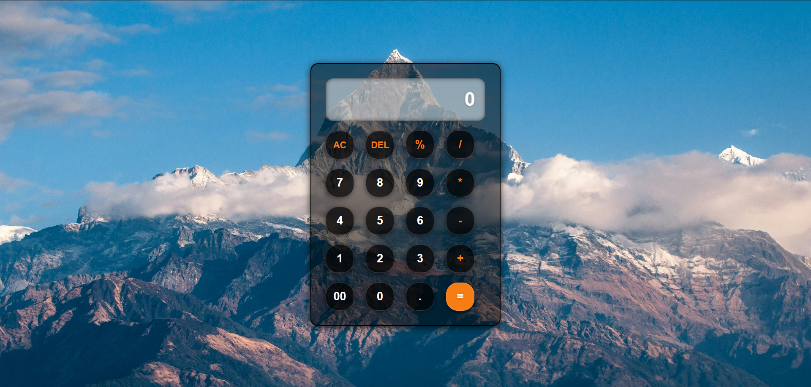

---
# Calculator Project

A simple and responsive calculator built using **HTML**, **CSS**, and **JavaScript**. This project is designed to be user-friendly and works seamlessly on both desktop and mobile devices.
---

## Author

**Shivin Kumar Gupta**
**guptashivinkumar@gmail.com**

---

## Features

- **Basic Operations**: Addition, subtraction, multiplication, and division.
- **Advanced Operations**: Percentage calculation.
- **Clear and Delete**: AC (All Clear) and DEL (Delete) buttons for easy editing.
- **Responsive Design**: Works on all screen sizes, from desktop to mobile.

---

## Technologies Used

- **HTML**: Structure of the calculator.
- **CSS**: Styling and responsive design.
- **JavaScript**: Logic for calculations and button functionality.

---

## How to Use

1. **Clone the Repository**:

   ```bash
   git clone https://github.com/Shivin-Kumar-Gupta-code/Calculator.git
   cd calculator-project
   ```

2. **Open the Project**:

   - Open the `index.html` file in your browser to use the calculator.

3. **Using the Calculator**:
   - **Numbers**: Click on the number buttons (`0-9`) to input numbers.
   - **Operators**: Use the operator buttons (`+`, `-`, `*`, `/`, `%`) to perform calculations.
   - **AC**: Clear the input field.
   - **DEL**: Delete the last character.
   - **=**: Compute the result of the expression.

---

## Code Structure

### 1. **HTML (`index.html`)**:

- Contains the structure of the calculator, including the input field and buttons.

### 2. **CSS (`style.css`)**:

- Styles the calculator with a dark theme and ensures responsiveness.
- Uses `flexbox` for layout and `media queries` for responsiveness.

### 3. **JavaScript (`script.js`)**:

- Handles the logic for button clicks, calculations, and input updates.
- Uses `eval()` to compute mathematical expressions (with error handling).

---

## Responsive Design

The calculator is designed to be fully responsive:

- **Desktop**: Fixed width with large buttons.
- **Tablet**: Slightly smaller buttons for medium screens.
- **Mobile**: Compact layout with smaller buttons for small screens.

---

## Customization

You can customize the calculator by:

1. Changing the background image in the `body` CSS rule.
2. Modifying the color scheme in the `style.css` file.
3. Adding new features (e.g., square root, exponentiation) in the `script.js` file.

---

## Example Calculations

- **Addition**: `2 + 3 = 5`
- **Subtraction**: `10 - 4 = 6`
- **Multiplication**: `5 * 6 = 30`
- **Division**: `20 / 4 = 5`
- **Percentage**: `50 % = 0.5`

---

## Screenshots

  
_Desktop View_

  
_Mobile View_

---

## Acknowledgments

- Inspired by simple calculator designs.
- Built with ❤️ by **Shivin Kumar Gupta**.

---

## How to Contribute

1. Fork the repository.
2. Create a new branch (`git checkout -b feature/YourFeatureName`).
3. Commit your changes (`git commit -m 'Add some feature'`).
4. Push to the branch (`git push origin feature/YourFeatureName`).
5. Open a pull request.

---

Enjoy using the calculator! If you have any questions or suggestions, feel free to reach out. 😊

---
